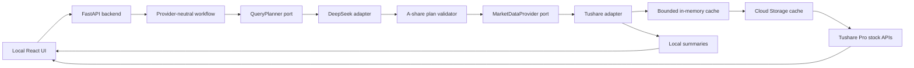

# A-Share Laboratory

A local laboratory for exploring mainland China A-share data with natural
language, deterministic safety checks, and transparent upstream results.

The project is designed for data experiments rather than trade execution or
investment advice. It currently covers equities listed on the Shanghai,
Shenzhen, and Beijing exchanges.

## Data foundation

The first market-data provider is Tushare Pro. Its stock-data catalog defines
the current upstream API boundary:

- **Official stock OpenAPI documentation:**
  [Tushare Pro Stock Data](https://tushare.pro/document/2?doc_id=14)
- Supported security suffixes: `.SH`, `.SZ`, and `.BJ`
- Current local allowlist: 108 stock-data API names
- Upstream permission, quota, and service errors are preserved for inspection

The official catalog includes security masters, trading calendars, historical
and real-time prices, valuation metrics, financial statements, company events,
shareholder data, margin data, money flow, and market-behavior datasets.

## What the laboratory does

Enter a request such as:

```text
How many A-share stocks rose or fell on July 17, 2026?
```

The application will:

1. interpret the request with DeepSeek;
2. produce a provider-neutral structured query plan;
3. validate the plan against the selected provider's operation catalog and the
   A-share boundary;
4. call the selected market-data provider from the local Python backend;
5. compute supported local summaries;
6. display the plan, source rows, and any upstream errors in the browser.

## Architecture



DeepSeek does not call Tushare directly. It only returns a JSON query plan
containing provider-neutral operation names, parameters, requested fields,
purposes, and optional controlled aggregations. The local backend validates and
executes that plan. Market-data result rows are not sent back to DeepSeek.

Multi-stage requests use a bounded execution DAG. Query nodes perform direct or
candidate-driven provider reads, while compute nodes apply one allowlisted
relational operator to upstream results. The backend validates acyclic
dependencies, provider contracts, field lineage, join cardinality, the final
answer contract, and fan-out limits before issuing any provider call. This lets
intermediate filters drive later Tushare queries without embedding business
phrases or fixed stage counts in the executor.

The application core depends on two replaceable ports:

- `QueryPlanner` translates natural language into a `QueryPlan`; DeepSeek is
  the current adapter.
- `MarketDataProvider` publishes an operation catalog and executes `DataQuery`
  objects; Tushare is the current adapter.

Provider-specific HTTP payloads, credentials, errors, operation names, and
cache-expiration rules remain inside their adapters. Adding another model or
data provider therefore does not require changing the API or orchestration
workflow. Provider selection is currently fixed during application startup;
runtime selection can be added later without changing these contracts.

## Current capabilities

| Area | Examples |
| --- | --- |
| Security reference | Listed stocks, company information, name changes, IPOs |
| Market data | Daily, weekly, monthly, adjusted prices, limits, suspensions |
| Valuation | Turnover, PE, PB, total market value, circulating market value |
| Financials | Income statement, balance sheet, cash flow, financial indicators |
| Company events | Dividends, repurchases, pledges, share unlocks |
| Market behavior | Top lists, block trades, margin data, money flow |
| Local summaries | Controlled numeric counts such as advanced, declined, and unchanged |
| Failure inspection | Original safe DeepSeek and Tushare error bodies |

Most Tushare APIs use one generic provider adapter. The transport, token use,
operation catalog, market validation, result conversion, and error handling are
local code. DeepSeek currently decides which operation to use and which
parameters and fields to request.

## Configuration

Create a local environment file:

```bash
cp .env.example .env
```

Add the three credentials and the private cache bucket:

```dotenv
TUSHARE_TOKEN=your_real_token
DEEPSEEK_API_KEY=your_real_key
ZAI_API_KEY=your_real_zai_key
LLM_BASE_URL=https://your-openai-compatible-api.example/v1
LLM_MODEL=your_model_identifier
LLM_API_KEY=your_model_api_key
LLM_API_SECRET=
RESEARCH_SANDBOX_URL=https://your-private-sandbox.example
TUSHARE_CACHE_BUCKET=your_private_cache_bucket
```

The `.env` file is ignored by Git. Credentials are read by the backend and are
never included in browser responses.

The web backend requires Cloud Storage access for persistent Tushare caching.
For local runs, authenticate Application Default Credentials before starting
the server:

```bash
gcloud auth application-default login
```

Successful market-data responses are cached by provider name, operation name,
normalized parameters, ordered fields, and cache schema version. Including the
provider prevents collisions when another data source is added. The
process-local L1 cache is bounded to 256 records and 128 MiB. The persistent L2
cache stores gzip-compressed JSON objects and survives Cloud Run scale-to-zero
events and deployments. Persistent Tushare caching is explicitly profiled for
every allowlisted operation:

- real-time and current intraday operations bypass both cache layers;
- reference data and unbounded latest disclosures refresh every 24 hours;
- the trading calendar refreshes every 30 days;
- fixed historical daily, intraday, and disclosure windows persist for 90 days;
- current end-of-day data refreshes around its documented publication window.

The Tushare adapter calculates expiration in `Asia/Shanghai`. Adding an
allowlisted Tushare operation without a cache profile fails fast at startup and
in tests, so future interfaces cannot silently inherit an unsafe default.
Upstream and cache errors are never stored as successful responses.

## Installation

Create the Python environment and install the backend:

```bash
python3 -m venv .venv
source .venv/bin/activate
python -m pip install -e '.[dev]'
```

Install and build the frontend:

```bash
cd frontend
pnpm install
pnpm run build
cd ..
```

## Run locally

Start the combined production-style application:

```bash
a-share-web
```

Open [http://127.0.0.1:8000/analysis](http://127.0.0.1:8000/analysis) for
data analysis or [http://127.0.0.1:8000/basic](http://127.0.0.1:8000/basic) for
reference data. The root path redirects to `/analysis`.

For frontend development, keep the backend running and start Vite separately:

```bash
cd frontend
pnpm run dev
```

Open [http://127.0.0.1:5173/analysis](http://127.0.0.1:5173/analysis) or
[http://127.0.0.1:5173/basic](http://127.0.0.1:5173/basic). Vite proxies
`/api` to the Python backend on port `8000`.

## Feishu research bot

The backend can receive signed Feishu custom-app events at
`/api/integrations/feishu/events`. Each research message creates an independent
durable agent task and immediately returns its task identifier instead of
running long research inside the callback request. The worker uses a configured
OpenAI-compatible model with an allowlisted read-only Tushare toolbox,
deterministic dataframe transformations, and a private secretless Python
sandbox for calculations that cannot be represented by structured operations.
The model transport is configured through `LLM_BASE_URL`, `LLM_MODEL`,
`LLM_API_KEY`, and the optional `LLM_API_SECRET`; changing compatible models
does not change the agent or research tools. The worker proactively replies at
material stages and posts the terminal answer. Results with more than ten rows,
or explicit export requests, can produce a three-sheet Excel workbook — results
with per-column notes and security-code quote-page links, a methodology sheet,
and a column-notes sheet — that is uploaded back to the originating Feishu
message and rendered by the token-protected read-only research viewer.

Users can send `查看进度` (optionally followed by a task identifier) to inspect
queued, running, succeeded, or failed state, and `重试` to resubmit a failed
turn. Named sessions within the same group or private chat are managed with
`新建会话 <名称>`, `新建对话 <名称>`, `会话列表`, and
`切换会话 <名称或编号>`. A session can also be created and used immediately with
`新建对话，<研究问题>` or `新建会话 <名称>，<研究问题>`. The backend resolves the
display name to a stable opaque session identifier, loads only that session's
bounded context, and persists the new turn under the same identifier. Tasks in
one named session may run concurrently. Completed turns are isolated by tenant,
chat, thread, user, and named session, and up to twelve completed exchanges are
retained as follow-up context. The legacy validated analysis workflow remains
available in code as a rollback path but is not the default Feishu runtime.

Mentioning the bot without additional text opens an interactive quick menu.
The card accepts a research prompt and exposes shortcuts for creating a session,
listing sessions, and checking task progress. The card also shows the active
research model with one-tap switching between DeepSeek (the deployed Codex
agent, pay-as-you-go) and GLM (the Zhipu Coding Plan quota through an
OpenAI-compatible tool loop); the same switch is available as the text
commands `切换模型 glm`, `切换模型 deepseek`, and `当前模型`. The choice
persists in the application bucket, applies to the next research task,
requires `ZAI_API_KEY` in the deployment for GLM, and always falls back to
the deployed DeepSeek default. Enable the Feishu
`card.action.trigger` callback and point its developer-server subscription to
the same `/api/integrations/feishu/events` endpoint used by message events.

The callback validates the Feishu request signature before decrypting AES-256-CBC
event envelopes. Plaintext bodies remain supported for local integration tests.

Feishu V2 bypasses the web application's `AnalysisService`. It reuses only the
provider catalog, audited Tushare adapter, and deterministic result-pipeline
executor. Feishu event claims, event-to-task mappings, named sessions,
conversation task pointers, and completed context are persisted so callback
retries do not create duplicate tasks and instance replacement cannot silently
lose an accepted request.

Configure these additional secrets before enabling the callback:

```dotenv
FEISHU_APP_ID=your_feishu_app_id
FEISHU_APP_SECRET=your_feishu_app_secret
FEISHU_VERIFICATION_TOKEN=your_feishu_verification_token
FEISHU_ENCRYPT_KEY=your_feishu_encrypt_key
FEISHU_ALLOWED_OPEN_IDS=
```

The Feishu application's published availability range is the primary user
boundary. `FEISHU_ALLOWED_OPEN_IDS` is an optional comma-separated second
allowlist for deployments that need a narrower boundary. Conversation objects,
task linkages, and event idempotency markers are stored privately under the
existing Cloud Storage cache bucket.

## Deploy to Google Cloud Run

The repository includes a multi-stage `Dockerfile`. It builds the React
frontend and serves the resulting files from the same FastAPI container, so a
deployment exposes only one HTTPS service.

The verified live-resource inventory, IAM boundaries, lifecycle policies, and
cost posture are maintained in
[`docs/gcp-resources.md`](docs/gcp-resources.md).

Recommended initial Cloud Run settings:

- Region: `asia-east2` (Hong Kong)
- Request-based billing
- 1 vCPU and 1 GiB memory
- Minimum instances: 0
- Maximum instances: 1
- Concurrency: 4
- Request timeout: 300 seconds
- Health endpoint: `/api/health`

Store `TUSHARE_TOKEN`, the legacy `DEEPSEEK_API_KEY`, `LLM_API_KEY`, and
`ZAI_API_KEY` in Secret Manager and expose them to the service as environment
variables. `LLM_API_SECRET` is optional and should also use Secret Manager when
the selected gateway requires it. Configure
`TUSHARE_CACHE_BUCKET` as a plain environment variable because it is a resource
identifier, not a secret.
Do not upload `.env`; it is excluded from Git, the Docker build context, and the
`gcloud` source upload.

### Routine delivery commands

Use the repository Makefile for validated delivery:

```bash
make check
make deploy
make merge
make release
```

`make deploy` accepts only a clean local `main` whose commit exactly matches
`origin/main`. It builds the frontend, deploys that commit to the existing Cloud
Run service, records the full Git commit in the service and worker environments,
updates the private research sandbox and asynchronous analysis Cloud Run Job to
the same immutable image, reapplies their scoped IAM and task lifecycle
policy, verifies 100% traffic and the public health endpoint, and updates
`docs/gcp-resources.md` with the live revision, Git source, and storage usage.

`make merge` must be run from a clean feature branch. It runs the same checks,
updates the local `main` branch from `origin/main` with fast-forward-only
semantics, creates a non-fast-forward merge commit, and pushes `main`. It stops
instead of committing untracked changes, resolving conflicts, or force-pushing.

`make release` is the one-command production path. It validates the current
workspace, rejects sensitive-looking or oversized files, stages and commits
the release changes, merges and pushes the feature branch into `main` when
needed, deploys that exact `main` commit, and commits the verified deployment
inventory update. Override the default commit subject when useful:

```bash
make release RELEASE_MESSAGE="Fix industry cohort analysis"
```

The command stops on test failures, merge conflicts, remote divergence,
deployment failures, or unexpected files created during deployment. It never
force-pushes or resolves conflicts automatically.

Production uses the `china-a-share-deploy-main-push` Cloud Build trigger with
the reconciliation workflow declared in `cloudbuild.reconcile.yaml`. A push to
`main` invokes the workflow immediately. The build compares the deployed
`APP_GIT_SHA` with the pushed `main` commit and deploys only when `main` is
strictly ahead.
Identical commits are a no-op; behind or diverged histories fail visibly.
An inventory-only change to `docs/gcp-resources.md` is also a no-op so recording
a verified deployment cannot trigger another deployment. The former
`china-a-share-reconcile-main` Scheduler job remains paused as a recovery
fallback. Unlike `make deploy`, push reconciliation never writes deployment
state back to Git.

After authenticating the Google Cloud CLI and selecting the project, a source
deployment can be created manually for recovery with:

```bash
gcloud run deploy china-a-share-lab \
  --source . \
  --project china-a-share-lab \
  --region asia-east2 \
  --allow-unauthenticated \
  --cpu 1 \
  --memory 1Gi \
  --min 0 \
  --max 1 \
  --concurrency 4 \
  --timeout 300 \
  --service-account china-a-share-runner@china-a-share-lab.iam.gserviceaccount.com \
  --set-env-vars TUSHARE_CACHE_BUCKET=china-a-share-lab-cache-asia-east2,FEISHU_APP_ID=cli_aa2df30a34f51d01 \
  --set-secrets TUSHARE_TOKEN=tushare-token:latest,DEEPSEEK_API_KEY=deepseek-api-key:latest,ZAI_API_KEY=zai-api-key:latest,FEISHU_APP_SECRET=feishu-app-secret:latest,FEISHU_VERIFICATION_TOKEN=feishu-verification-token:latest,FEISHU_ENCRYPT_KEY=feishu-encrypt-key:latest
```

Create the three named secrets and the private regional cache bucket before
deployment. After provisioning the Z.AI secret, update the verified live
inventory in `docs/gcp-resources.md`. Apply `infra/cache-lifecycle.json`, disable
object versioning and soft delete, and grant the Cloud Run service account
`roles/storage.objectUser` on that bucket only. Making the service public with
`--allow-unauthenticated` should only be done after login and request-rate
protection are enabled, or for a short controlled connectivity test.

Cloud Run supplies the `PORT` environment variable. The container binds to
`0.0.0.0` through `APP_HOST`, while ordinary local runs continue to default to
`127.0.0.1:8000`.

## Suggested experiments

### Market and valuation

```text
Retrieve daily prices for 000001.SZ from July 1 through July 17, 2026.
```

```text
Retrieve turnover rate, PE, PB, and total market value for 000001.SZ on July 17, 2026.
```

### Financial statements

```text
Retrieve the 2025 annual income statement for 600519.SH.
```

```text
Retrieve ROE, gross margin, net margin, and EPS for 600519.SH for the 2025 annual period.
```

### Events and market behavior

```text
Retrieve recent share-repurchase records for 600519.SH.
```

```text
Retrieve A-share block trades on July 17, 2026.
```

### Permission error handling

```text
Use moneyflow_ths to retrieve all A-share money-flow data for July 17, 2026.
```

If the Tushare account lacks access, the UI should show the upstream error code,
message, HTTP status when available, and safe raw response.

## Command-line utilities

The original direct data checks remain available:

```bash
a-share check
a-share daily --code 000001.SZ --start 20240101 --end 20240131
a-share stocks --output data/stocks.csv
```

## Quality checks

Run backend tests:

```bash
pytest
```

Run the unified 100-question end-to-end quality matrix and production-reported
regressions against the real DeepSeek and Tushare APIs:

```bash
ALLOW_PAID_LIVE_TESTS=1 make live-check
```

The explicit acknowledgment prevents routine development and automated agent
work from accidentally spending model or market-data quota. This opt-in check
validates planning semantics, provider operations, result
pipelines, business invariants, unsupported capability boundaries, and prompts
reported from production rather than exact model JSON. It loads
`DEEPSEEK_API_KEY` and `TUSHARE_TOKEN` from `.env`, uses an in-process cache
without Google Cloud credentials, runs independent matrix cases with two
bounded worker threads, and consumes real upstream API quota. The
100 fixed cases require at least 100 DeepSeek planning requests; bounded retries
can raise that total to 500, and production regressions add their own calls. The
default test suite skips the external cases so routine tests remain deterministic
and offline.

Validate the frontend production build:

```bash
cd frontend
pnpm run build
```

## Current limitations

- DeepSeek has detailed guidance for the most common APIs but not yet a complete
  parameter and field schema for every allowlisted Tushare interface.
- Uncommon requests may select the correct API but produce an invalid parameter
  or field; the resulting Tushare error remains visible for diagnosis.
- The backend returns raw tables and controlled conditional counts. It does not
  yet provide general joins, ranking, formulas, chart generation, or portfolio
  analysis.
- Large results are returned by the API in full, while the browser displays the
  first 100 rows.
- The in-memory cache is lost when Cloud Run scales to zero. The Cloud Storage
  cache preserves successful responses, but it is not a general-purpose query
  database and does not provide cross-query range merging.
- Availability depends on the permissions, points, quotas, and rate limits of
  the configured Tushare account.

## Roadmap

1. Build a local schema registry for every supported Tushare stock interface.
2. Add a deterministic rule-based planner for common experiments.
3. Support `rules`, `deepseek`, and `hybrid` planning modes.
4. Add pagination and downloadable result artifacts.
5. Add controlled joins, ranking, time-series summaries, and charts.
6. Package local storage and remote deployment without changing API contracts.

The long-term goal is a reproducible A-share research workspace where model
assistance is optional, data access is explicit, and every result can be traced
back to a validated Tushare query.
