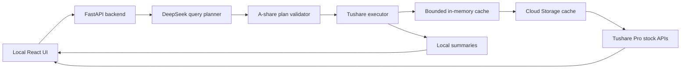

# A-Share Laboratory

A local laboratory for exploring mainland China A-share data with natural
language, deterministic safety checks, and transparent Tushare results.

The project is designed for data experiments rather than trade execution or
investment advice. It currently covers equities listed on the Shanghai,
Shenzhen, and Beijing exchanges.

## Data foundation

The laboratory uses the Tushare Pro stock-data catalog as its upstream API
boundary:

- **Official stock OpenAPI documentation:**
  [Tushare Pro Stock Data](https://tushare.pro/document/2?doc_id=14)
- Supported security suffixes: `.SH`, `.SZ`, and `.BJ`
- Current local allowlist: 108 stock-data API names
- Upstream permission, quota, and service errors are preserved for inspection

The official catalog includes security masters, trading calendars, historical
and real-time prices, valuation metrics, financial statements, company events,
shareholder data, margin data, money flow, and market-behavior datasets.

## What the laboratory does

Enter a request such as:

```text
How many A-share stocks rose or fell on July 17, 2026?
```

The application will:

1. interpret the request with DeepSeek;
2. produce a structured Tushare query plan;
3. validate the plan against the stock API allowlist and A-share boundary;
4. call Tushare from the local Python backend;
5. compute supported local summaries;
6. display the plan, source rows, and any upstream errors in the browser.

## Architecture



DeepSeek does not call Tushare directly. It only returns a JSON query plan
containing API names, parameters, requested fields, purposes, and optional
controlled aggregations. The local backend validates and executes that plan.
Tushare result rows are not sent back to DeepSeek.

## Current capabilities

| Area | Examples |
| --- | --- |
| Security reference | Listed stocks, company information, name changes, IPOs |
| Market data | Daily, weekly, monthly, adjusted prices, limits, suspensions |
| Valuation | Turnover, PE, PB, total market value, circulating market value |
| Financials | Income statement, balance sheet, cash flow, financial indicators |
| Company events | Dividends, repurchases, pledges, share unlocks |
| Market behavior | Top lists, block trades, margin data, money flow |
| Local summaries | Controlled numeric counts such as advanced, declined, and unchanged |
| Failure inspection | Original safe DeepSeek and Tushare error bodies |

Most Tushare APIs use one generic request executor. The transport, token use,
allowlist, market validation, result conversion, and error handling are local
code. DeepSeek currently decides which API to use and which parameters and
fields to request.

## Configuration

Create a local environment file:

```bash
cp .env.example .env
```

Add both credentials and the private cache bucket:

```dotenv
TUSHARE_TOKEN=your_real_token
DEEPSEEK_API_KEY=your_real_key
TUSHARE_CACHE_BUCKET=your_private_cache_bucket
```

The `.env` file is ignored by Git. Credentials are read by the backend and are
never included in browser responses.

The web backend requires Cloud Storage access for persistent Tushare caching.
For local runs, authenticate Application Default Credentials before starting
the server:

```bash
gcloud auth application-default login
```

Successful Tushare responses are cached by API name, normalized parameters,
ordered fields, and cache schema version. The process-local L1 cache is bounded
to 256 records and 128 MiB. The persistent L2 cache stores gzip-compressed JSON
objects and survives Cloud Run scale-to-zero events and deployments. Cache
expiration is calculated in `Asia/Shanghai` from conservative Tushare
publication windows. Upstream and cache errors are never stored as successful
responses.

## Installation

Create the Python environment and install the backend:

```bash
python3 -m venv .venv
source .venv/bin/activate
python -m pip install -e '.[dev]'
```

Install and build the frontend:

```bash
cd frontend
pnpm install
pnpm run build
cd ..
```

## Run locally

Start the combined production-style application:

```bash
a-share-web
```

Open [http://127.0.0.1:8000](http://127.0.0.1:8000).

For frontend development, keep the backend running and start Vite separately:

```bash
cd frontend
pnpm run dev
```

Open [http://127.0.0.1:5173](http://127.0.0.1:5173). Vite proxies `/api` to
the Python backend on port `8000`.

## Deploy to Google Cloud Run

The repository includes a multi-stage `Dockerfile`. It builds the React
frontend and serves the resulting files from the same FastAPI container, so a
deployment exposes only one HTTPS service.

Recommended initial Cloud Run settings:

- Region: `asia-east2` (Hong Kong)
- Request-based billing
- 1 vCPU and 1 GiB memory
- Minimum instances: 0
- Maximum instances: 1
- Concurrency: 4
- Request timeout: 300 seconds
- Health endpoint: `/api/health`

Store `TUSHARE_TOKEN` and `DEEPSEEK_API_KEY` in Secret Manager and expose them
to the service as environment variables. Configure `TUSHARE_CACHE_BUCKET` as a
plain environment variable because it is a resource identifier, not a secret.
Do not upload `.env`; it is excluded from Git, the Docker build context, and the
`gcloud` source upload.

After authenticating the Google Cloud CLI and selecting the project, a source
deployment can be created with:

```bash
gcloud run deploy china-a-share-lab \
  --source . \
  --project china-a-share-lab \
  --region asia-east2 \
  --allow-unauthenticated \
  --cpu 1 \
  --memory 1Gi \
  --min 0 \
  --max 1 \
  --concurrency 4 \
  --timeout 300 \
  --service-account china-a-share-runner@china-a-share-lab.iam.gserviceaccount.com \
  --set-env-vars TUSHARE_CACHE_BUCKET=china-a-share-lab-cache-asia-east2 \
  --set-secrets TUSHARE_TOKEN=tushare-token:latest,DEEPSEEK_API_KEY=deepseek-api-key:latest
```

Create the two named secrets and the private regional cache bucket before
deployment. Apply `infra/cache-lifecycle.json`, disable object versioning and
soft delete, and grant the Cloud Run service account `roles/storage.objectUser`
on that bucket only. Making the service public with
`--allow-unauthenticated` should only be done after login and request-rate
protection are enabled, or for a short controlled connectivity test.

Cloud Run supplies the `PORT` environment variable. The container binds to
`0.0.0.0` through `APP_HOST`, while ordinary local runs continue to default to
`127.0.0.1:8000`.

## Suggested experiments

### Market and valuation

```text
Retrieve daily prices for 000001.SZ from July 1 through July 17, 2026.
```

```text
Retrieve turnover rate, PE, PB, and total market value for 000001.SZ on July 17, 2026.
```

### Financial statements

```text
Retrieve the 2025 annual income statement for 600519.SH.
```

```text
Retrieve ROE, gross margin, net margin, and EPS for 600519.SH for the 2025 annual period.
```

### Events and market behavior

```text
Retrieve recent share-repurchase records for 600519.SH.
```

```text
Retrieve A-share block trades on July 17, 2026.
```

### Permission error handling

```text
Use moneyflow_ths to retrieve all A-share money-flow data for July 17, 2026.
```

If the Tushare account lacks access, the UI should show the upstream error code,
message, HTTP status when available, and safe raw response.

## Command-line utilities

The original direct data checks remain available:

```bash
a-share check
a-share daily --code 000001.SZ --start 20240101 --end 20240131
a-share stocks --output data/stocks.csv
```

## Quality checks

Run backend tests:

```bash
pytest
```

Validate the frontend production build:

```bash
cd frontend
pnpm run build
```

## Current limitations

- DeepSeek has detailed guidance for the most common APIs but not yet a complete
  parameter and field schema for every allowlisted Tushare interface.
- Uncommon requests may select the correct API but produce an invalid parameter
  or field; the resulting Tushare error remains visible for diagnosis.
- The backend returns raw tables and controlled conditional counts. It does not
  yet provide general joins, ranking, formulas, chart generation, or portfolio
  analysis.
- Large results are returned by the API in full, while the browser displays the
  first 100 rows.
- The in-memory cache is lost when Cloud Run scales to zero. The Cloud Storage
  cache preserves successful responses, but it is not a general-purpose query
  database and does not provide cross-query range merging.
- Availability depends on the permissions, points, quotas, and rate limits of
  the configured Tushare account.

## Roadmap

1. Build a local schema registry for every supported Tushare stock interface.
2. Add a deterministic rule-based planner for common experiments.
3. Support `rules`, `deepseek`, and `hybrid` planning modes.
4. Add pagination and downloadable result artifacts.
5. Add controlled joins, ranking, time-series summaries, and charts.
6. Package local storage and remote deployment without changing API contracts.

The long-term goal is a reproducible A-share research workspace where model
assistance is optional, data access is explicit, and every result can be traced
back to a validated Tushare query.
